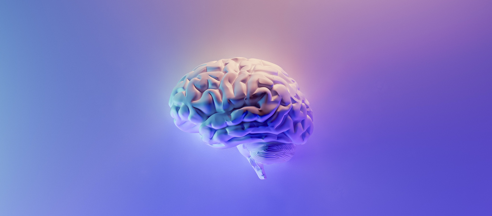

# Optimizing Your Learning (OYL)

Photo by Milad Fakurian on Unsplash

## Course Description

Optimizing Your Learning aims to transform you into an effective and empowered self-directed learner. In the modern world, long-term academic, professional, and personal success is driven by the ability of individuals to take control of their learning. Therefore, this course will support you in developing the knowledge, skills, and mindsets needed to take ownership of your learning and build your self-efficacy.

During the course, you will develop competence in skills that are most critical for effective self-directed learning (i.e. planning, monitoring, and evaluating your learning) while also learning how to use learning strategies to maximize your overall learning efficiency and efficacy. You will also use the emotional intelligence framework to explore your identity, self-awareness, motivation, and self-regulation skills in support of your development as a self-directed learner.

The course will conclude with the creation of a personal learning charter that will help guide you in your learning throughout your time at Kibo and in other areas of your life.

## Course Learning Outcomes

By the end of this course, you will be able to:

- Explain how learning happens in the brain, and apply this knowledge to improve your learning process.
- Implement a structured self-directed learning process.
- Understand and improve your self-awareness, self-regulation, and motivation.
- Identify the internal and external factors that influence your learning and develop strategies to leverage them to increase the effectiveness of your learning.
- Develop a reflective practice to support deep learning.

## Weekly Lessons

<aside>

👩🏿‍🏫 Complete this course by exploring each week’s lesson. Lessons will be released each Sunday.

</aside>

[Week 0: Welcome!](/optimizing-your-learning/welcome.md)

[Week 1 - How to Get Anything You Want in Life](/optimizing-your-learning/how-to-get-anything-you-want-in-life.md)

[Week 2 - Understanding Your Mindsets and Emotions] <!-- (/optimizing-your-learning/understanding-your-mindsets-and-emotions.md) -->

[Week 3 - Managing Your Learning Context] <!-- (/optimizing-your-learning/managing-your-learning-context.md) -->

[Week 4 - Building Your Learning Toolkit] <!-- (/optimizing-your-learning/building-your-learning-toolkit.md) -->

[Week 5 - Final Assessments] <!-- (/optimizing-your-learning/final-assessments.md) -->
