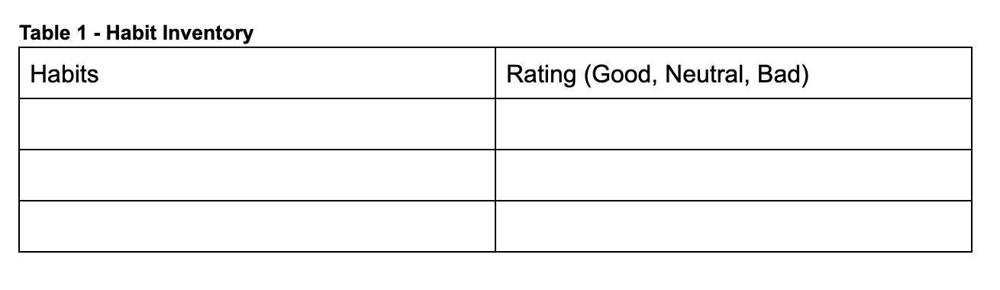

# Assignment 4 - Habit Inventory and Change Plan

---

<aside>

📝 Complete the assignment below

</aside>

**Due date: November 7th, 2022**

## Brief

This week's assignment will require you to write about your habits and develop a plan to break one bad habit and create one good habit.

### Task 1 - Habit Identification

- Think through all the things that you do in a typical day and identify your habits. 
- Try to identify between 10-15 habits that you have. These can be habits that you do daily (e.g. make your bed after waking up), or they can be habits that you do after specific cues (e.g. eat chocolate when you feel anxious). 
- Create a table like the habit inventory (Table 1) shown below, and then rate whether you think each of your habits is good, neutral, or bad. 

According to James Clear, a useful way to classify habits is to ask the question, “Does this behavior help me become the type of person I wish to be?” Good habits reinforce your desired identity, bad habits conflict with your desired identity, and neutral habits seem unrelated.

### Task 2 - Breaking a Bad Habit

- Select one of the bad habits from your habit inventory that you would like to break. 
- Identify the Cue, Craving, Response, and Reward (i.e. the habit loop) for this habit.
- Identify 1-2 actions that you could take to influence each stage of the habit loop so that you could break the habit, and create an action plan for breaking this habit.
- Remember to break a bad habit you should make it: Invisible, Unattractive, Difficult, and Unsatisfying.

**Tip:** Re-watch the video in section 4.2 Habits that gives a detailed summary of James Clear’s book “Atomic Habits”. The end of the video has a great example of how to create a plan to break a habit.

### Task 3 - Creating a Good Habit

- Determine a good habit that you would like to form.
- Identify the Cue, Cravings, Response, and Reward (i.e. the habit loop) for this habit.
- Identify 1-2 actions that you could take to influence each stage of the habit loop so that you could form this habit more easily, and create an action plan for forming this habit.
- Remember to make a good habit you should make it: Obvious, Attractive, Easy, and Satisfying.

**Tip:** Re-watch the  video in section 4.2 Habits that gives a detailed summary of James Clear’s book “Atomic Habits”. The end of the video has a great example of how to create a plan to form a habit.

## Submission

Save your responses to task 1, 2, and 3 as a single pdf and submit on Gradescope, then upload to the Woolf platform.

---
