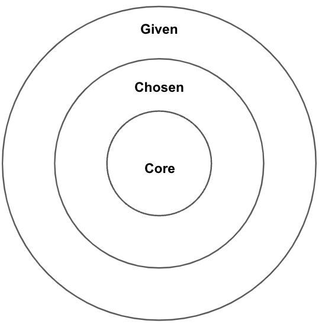

# Identity: Know Thyself

*Estimated Time: 30 minutes*

---

<aside>

⚠️ You may recognize some of this section from the Kibo Challenge that was part of your application to join the degree program.

</aside>

## Identity

An **identity** is a person's **formulation and expression** of their **individuality and group affiliations**. It may be defined as the **distinctive characteristics** belonging to an individual or shared by all members of a specific social category or group.

**Some examples of identity groups include:**

|  |  | |
| :---: | :---: | :---: |
| Gender | Religion | Nationality|
| Disability | Socioeconomic Status | Culture |
| Age | Education Attainment | Ability |
| Ethnicity | Language | Race |

- Each person has a set of identities (We all have multiple identities)
- Each person **chooses** at least some identities, while other identities are **given**.
- People feel differently about different identities. 
- Some identities are more important than others. 
- Some identities are visible, while others are less apparent. 
- Some identities change over time, while others are constant.

## Identity Mapping

<aside>
  
Creating a map of your identity is a way to capture and articulate how you see yourself. You can look clearly at your obvious, surface-level identity and then begin to dig deeper…Your identity map should include the three components…given identity, chosen identity, and core identity.

- Kelly Hannum. (2007). Social Identity: Knowing Yourself, Leading Others. Center for Creative Leadership.

</aside>

### Given, Chosen, or Core Identities

> **Given Identities** - These are the attributes or conditions that you have no choice about. They may be characteristics you were born with or they may have been given to you in childhood or later in life. Elements of your given identity include your birthplace, age, gender, birth order, physical characteristics, certain family roles, and possibly religion.
>

> **Chosen Identities** - These are the characteristics that you choose. They may describe your status as well as attributes and skills. Your occupation, hobbies, political affiliation, place of residence, family roles, and religion may all be chosen.
>

> **Core Identities** - The attributes that you think make you unique as an individual. Some will change over the course of your lifetime, others may remain constant. Elements of your core identity may include behaviors, beliefs, values, and skills.
>

Source: Hannum, K. (2008). Leadership in Action: Branching out: Social Identity Comes to the Forefront. Center for Creative Leadership.

<!--  -->

### Reflection: Reflecting on Your Identities

<aside>

🪞 Reflect on your identities, and create your own identity map by listing out the traits that you think fall under your Given, Chosen, and Core identities.

**Once you have created your identity map, answer the questions in the padlet below.**

</aside>

<iframe src="https://padlet.com/embed/5jcn8rwuhqgiwri2" frameborder="0" allow="camera;microphone;geolocation" style="width:100%;height:608px;display:block;padding:0;margin:0"></iframe>

Adapted from Social Identity Wheel. (n.d). Inclusive Teaching at U-M. Retrieved May 15, 2022, from [https://sites.lsa.umich.edu/inclusive-teaching/social-identity-wheel/](https://sites.lsa.umich.edu/inclusive-teaching/social-identity-wheel/)

---

<aside>

📺 Watch the following video to learn how identity (or labels) impact your beliefs. We will be diving deeper into belief systems in the next section.

</aside>

<iframe src="https://www.youtube.com/embed/ASIyewSYzwc" title="YouTube video player" frameborder="0" allow="accelerometer; autoplay; clipboard-write; encrypted-media; gyroscope; picture-in-picture" allowfullscreen style="position: absolute; top: 0; left: 0; width: 100%; height: 100%;"></iframe>

## Reflection: Identities and Beliefs

<aside>

🪞 **Answer the question in the padlet below.**
Do you have any beliefs (either positive or negative) about yourself that are a result of one of your identities?
(e.g. I’m good at basketball because I’m tall, I’m not good at expressing my emotions because I’m a man, I'm bad at math because I'm a woman)

</aside>

<iframe src="https://padlet.com/embed/c31ch02yymllbyeq" frameborder="0" allow="camera;microphone;geolocation" style="width:100%;height:608px;display:block;padding:0;margin:0"></iframe>

---

