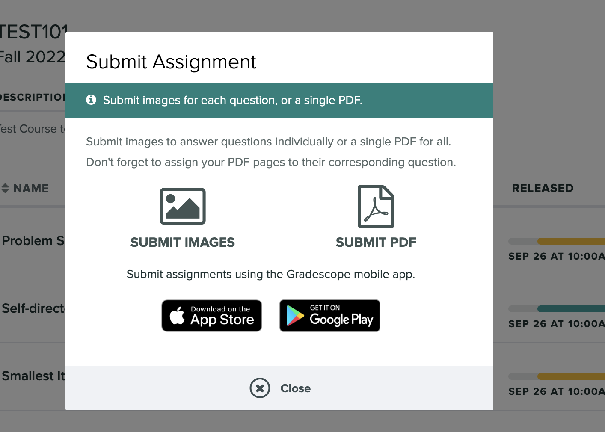

# Course Assessments

*Estimated Time: 15 minutes*

---

## **Weekly Assignments (50%)**

<aside>
"To be ready for tomorrow's opportunties, do your homework today. Learn, refine your skills, and focus on growth." - Unknown
</aside>
 
During weeks 1, 2, 3, and 4. you will have a weekly assignment that will be due on the Monday of the following week. The weekly assignments are:

Week 1 - Letter to Future Self (Due date: July 17th, 2023, 10pm GMT)

Week 2 - Overcoming Limiting Beliefs (Due date: July 24th, 2023, 10pm GMT)

Week 3 - Learning Context Experiment (Due date: July 31st, 2023, 10pm GMT)

Week 4 - Habit Inventory and Change Plan (Due date: August 7th, 2023, 10pm GMT)

More information about each assignment can be found on the assignment page of each week’s lesson.

All four assignments will be worth 50% of your final grade, therefore each assignment is 12.5% of your final grade. 

---

## **Final Essay (25%) - Personal Learning Charter**

<aside>
Learn to plan and plan to learn.
</aside>

One of your final assessments for this course will be the creation of a personal learning charter. This learning charter will inlcude the following information: 

- Who You Are
- Your Learning Beliefs
- Your Learning Motivations and Interests
- Your Learning Goals
- Your Implementation Intentions
- Your Strengths and Weaknesses
- Your Learning Tool and Resource System 
- Your Learning Metrics and Milestones System

The total word count for this essay is 1000-1500 words, and your grade on this assessment counts towards 25% of your final grade for this course.

---

## **Final Presentation (25%) - Self-Directed Learning (SDL)**

<aside>
"People learn the most when teaching others." - Peter F. Drucker
</aside>

For your second final assessment, you will carry out a self-directed learning project by yourself. Your goal is to select a topic that you will learn about, create a learning plan, implement your learning plan, and then submit a video lesson teaching the topic to the rest of your classmates. 

You will be required to work on this project throughout the 5 weeks of the course, and there are some milestones that you will need to reach during weeks 2, 3, and 4.

- Week 2: Milestone 1 (Planning) -  Pick your topic, set your specific learning goals, and create a plan and schedule for how you will achieve your learning goals.

- Week 3: Milestone 2 (Monitoring) - Carry out your learning plan and monitor your progress.

- Week 4: Milestone 3 (Evaluation 1) - Create your video lesson on your chosen topic.

- Week 5: Milestone 4 (Evaluation 2) - Evaluate the quality of your learning, and reflect on the learning experience.

At the end of the term you will need to submit:

- Your learning plan (Milestone 1)
- A video lesson on your SDL topic (Milestone 3)
- Your learning self-evaluation (Milestone 4)
- A written reflection on the learning experience (Milestone 4)

More details, as well as template documents for some of the Milestone deliverables will be provide in the Final Presentation Milestone sections in Lessons 2, 3, and 4, and the Week 5 Final Assessment lesson.

---

## How to Submit Your Assignments

All written assignments will need to be submitted in Gradescope by their stated due date. 

When you sign into Gradescope for Optimizing Your Learning, you will see all your pending assignments on your Dashboard. Click on the assignment that you would like to submit work for, and you will get the prompt to upload your work (See picture below). For Optimizing Your Learning, please submit your work as a PDF. 

**You will also need to submit a copy of your assignment in the Woolf platform, so that they have the academic record of your submission.**

---
