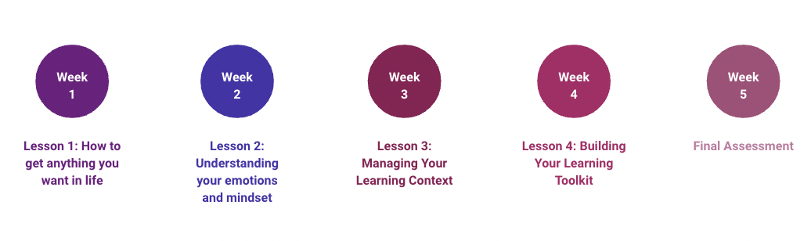

# Course Topics

*Estimated Time: 15 minutes*

---

**Week 1 - How to Get Anything You Want in Life**

Learning is an activity that defines human development. The fact that you can walk, talk, read, etc. is all due to your ability to learn. And in a modern world that is changing at break neck speed, the ability to learn effectively and efficiently is one of the most important skills that will help you to achieve your goals. But most educational institutions are so focused on **what** we should learn, that they often forget to teach students **how** learning actually happens and **how** they can harness this process to become more effective learners. Therefore, to kickstart your journey to optimizing your learning, we will learn about what happens in your brain when you learn, then we will explore a set of critical cognitive skills that govern how affective you are when learning. 

**Week 2 - Understanding Your Mindsets and Emotions**

In week 1, we explore the cognitive side of learning. However, effective learning isn't only driven by cognition. Therefore, during the 2nd week of the course, we will examine the impact that emotions and mindsets have on your learning. We will start our journey by delving into how your identities can impact (positively or negatively) what you think you are capable of, and how these identities can create beliefs that limit you from achieving your goals. We will then explore some other beliefs and behaviors that can sabotage your learning, before learning about a powerful mindset that can counteract these challenges and supercharge your abilities. Finally, we will dive into a framework for understanding emotional intelligence, and discuss ways to improve your self-awareness, self-regulation, and motivation.

**Week 3 - Managing Your Learning Context**

After spending the first two weeks of this course focused primarily on the brain, in week 3 we will move into discussing how your body and external learning context impact your learning. We will first learn how to manage your physical energy, by discussing the influence of stress, food, movement, and sleep on your ability to learn effectively. Then we will explore some tools that can be used to effectively manage your time. We will conclude by discussing how you can set up your external environment to help make your learning more successful, and how you can leverage other people to improve your learning.

**Week 4 - Building Your Learning Toolkit**

Finally, in week 4 we will get very tactical about ways to optimize your learning. We will start the week by learning how to set high quality goals, and utilize an approach to help you achieve those goals. Next we will discuss how you can use habits to make your learning process more automatic and effortless, then we will explore ways to improve your focus and attention. Next you will be introduced to numerous strategies to improve your learning, before discussing you to use reflection to learn from your past experiences.

**Week 5 - Final Assessment**

The final week of the course will be focused on completing the final assessments. There are two final assessments:
1) A final essay, which will require you to create a personal learning charter.
2) A final project, which will require you to carry out a self-directed learning project over the course of the entire 5 weeks, and submit a video presentation where you give a short lesson on your topic to your classmates.
 
More details on both of these assessments can be found on the [Course Assessments](/optimizing-your-learning/welcome/course-assessments.md) page.

---
