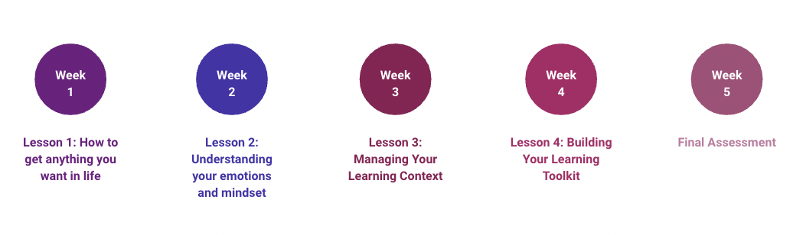

# Course Topics

*Estimated Time: 15 minutes*
---

**Week 1 - How to Get Anything You Want in Life**

Topics covered include: How Learning Happens, Executive Functioning Skills, Learning Approaches, Self-Directed Learning, and Reflective Practice

**Week 2 - Understanding Your Mindsets and Emotions**

Topics covered include: Identity, Beliefs that Hinder Learning, A Powerful Mindset That Supports Learning, Introduction to Emotional Intelligence, Understanding and Enhancing Your Self-Awareness, Developing Self-Regulation Skills, and Managing and Sustaining Motivation.

**Week 3 - Managing Your Learning Context**

Topics covered include: Managing Stress, Breathing, and Mindfullnes, Food and Movement, Sleep, Time Management, Physical Environment, and Learning With Others.

**Week 4 - Building Your Learning Toolkit**

Topics covered include: Habits, Memory, Focus and Attention, Flow State, and Learning Strategies.
---
